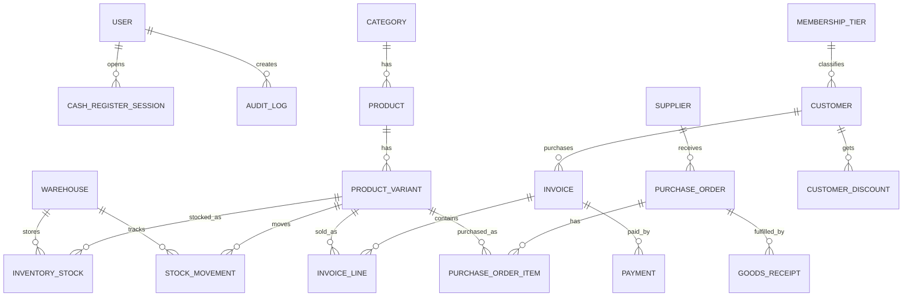

# POS Database Schema (PostgreSQL + Prisma)

## ER Diagram (Mermaid)

## Key transactional rules

- `Invoice` creation + `InventoryStock` decrement + `StockMovement` insert happen in one serializable transaction.
- Invoice numbering uses `InvoiceSequence` keyed by date (`INV-YYYYMMDD-#####`).
- Variant stock is unique by `(warehouseId, productVariantId)`.
- Product variant identity is unique by `(productId, sizeLabel, colorLabel)`.
- Customer phone is unique for fast lookup and khata tracking.

## Migration strategy

1. Run Prisma migration against PostgreSQL: `npm run prisma:migrate -w apps/api`.
2. Generate Prisma client: `npm run prisma:generate -w apps/api`.
3. Seed base catalog/users/stock: `npm run db:seed`.
